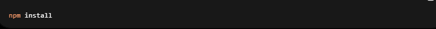
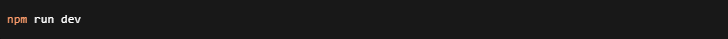
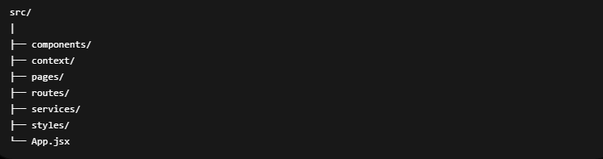
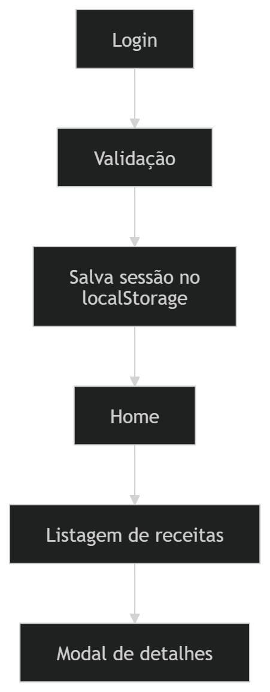

🍽️ Savory — Explore receitas de forma simples e moderna

  
 

📖 Sobre o projeto

O Savory é uma aplicação web desenvolvida com React 18 que permite aos usuários explorar receitas culinárias de maneira intuitiva e moderna.

A aplicação conta com um sistema de autenticação simples utilizando e-mail e senha, persistência de sessão com localStorage e integração com a API pública TheMealDB, permitindo listar receitas por categorias e visualizar detalhes completos através de modais interativos.

O projeto foi desenvolvido com foco em:

Organização de componentes
Boas práticas com React
Navegação SPA
Gerenciamento global de estado
Experiência visual moderna e responsiva

✨ Funcionalidades

✅ Autenticação com validação de login
✅ Persistência de sessão com localStorage
✅ Navegação dinâmica com React Router DOM
✅ Busca de receitas por categoria
✅ Listagem em cards responsivos
✅ Modal com detalhes completos da receita
✅ Gerenciamento de estado global com Context API
✅ Interface moderna e responsiva
✅ Deploy online via GitHub Pages

🚀 Tecnologias utilizadas

Tecnologia	Descrição
React 18	Biblioteca principal da aplicação
Vite	Build tool moderna
React Router DOM v7	Gerenciamento de rotas
Context API	Estado global
TheMealDB API	API de receitas
GitHub Pages	Deploy da aplicação

🛠️ Instalação

# Clone o projeto
git clone https://github.com/seu-usuario/savory.git

# Instale as dependências 

 

# Execute o projeto
 

# API utilizada

A aplicação consome dados da API pública:

https://www.themealdb.com/

# 📂 Estrutura do projeto

 

# 🔑 Fluxo da aplicação
 

# 📱 Responsividade

O projeto foi desenvolvido seguindo conceitos de responsividade para funcionar em:

📱 Mobile
💻 Desktop
📲 Tablets
🚀 Deploy

